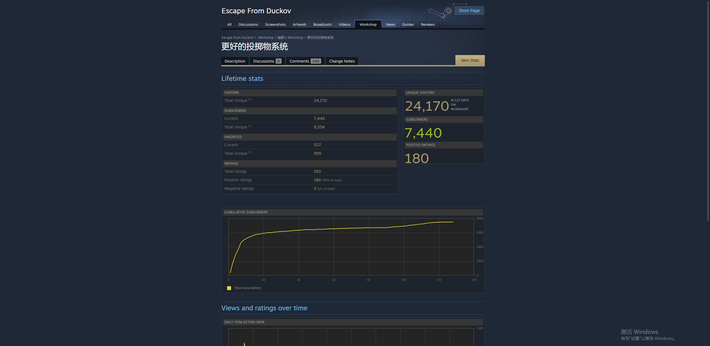
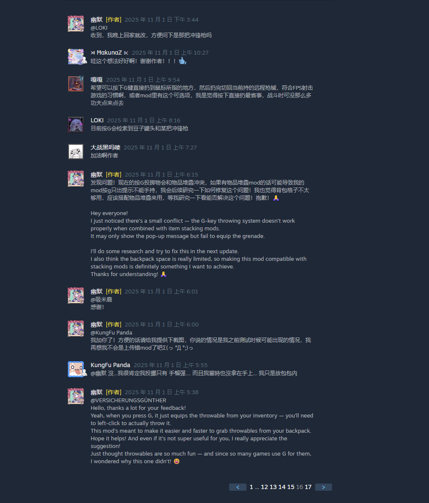
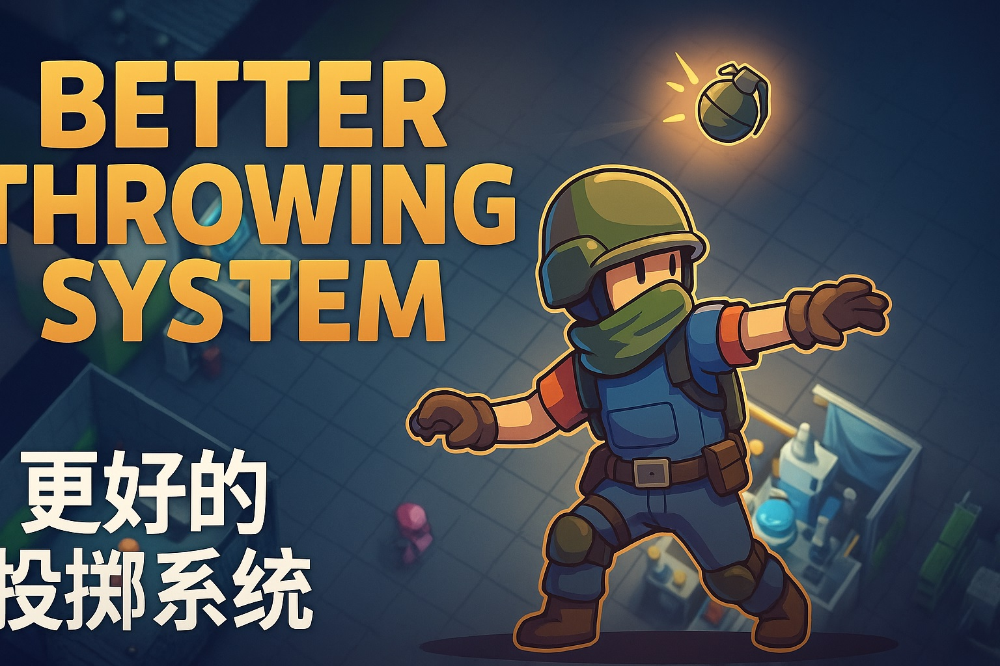

# BetterThrowingSystem — Duckov Mod Showcase

An AI-assisted gameplay improvement mod for **Escape from Duckov**, designed to make throwable item usage faster, smoother, and more flexible for real players.

## Quick Summary

- **Project Type:** Gameplay quality-of-life mod / product-style modding project
- **Game:** Escape from Duckov
- **Role:** Problem discovery, feature design, AI-assisted implementation workflow, testing, iteration, and release
- **Tech Context:** C#, game modding APIs, Unity-based game environment
- **Focus Areas:** Gameplay usability, inventory flow, hotkey interaction, mod settings, iteration based on player needs

## Project Background

I started this project after noticing friction in the default throwable workflow during gameplay.  
Switching between weapons and throwable items felt restrictive, and the interaction flow was not as smooth or practical as it could be in active combat situations.

The original goal was simple: improve throwable access and make the experience more intuitive.  
As the project evolved, I expanded it based on testing, limitations in the game workflow, and feedback from other players.

## What the Mod Does

BetterThrowingSystem improves throwable item handling in several ways:

- supports more convenient throwable item access
- allows faster switching with hotkeys
- improves inventory detection for throwable-related items
- adds configurable throw behavior options
- supports mod settings integration
- improves post-throw flow with auto switch-back behavior
- reduces friction in repeated gameplay actions

## Key Features

### Core Features
- **Throwable inventory support**  
  Allows players to carry and manage up to 5 throwable items more conveniently.

- **Fast switching with hotkeys**  
  Press **G** to quickly switch to throwable items from equipped gear.

- **Automatic scanning**  
  Automatically detects throwable items and food items from the player inventory.

### Later Improvements
- **Mod Settings UI support**  
  Added an in-game settings interface through a separate Mod Settings dependency.

- **Two throw modes**
  - **Press G to Equip**
  - **Press G to Throw**

- **Auto switch-back after throw**  
  Returns the player to their weapon after throwing for smoother gameplay flow.

- **Throwable stacking**  
  Reduces inventory pressure.

- **Faster throw charge option**  
  Adds an optional speed improvement for throwable charge time.

- **Improved item detection logic**  
  Refined recognition rules and excluded incorrect matches.

- **Simple throwable radial menu**  
  Added an early radial selector for throwable selection.

## My Role

This project reflects my work in:

- identifying a concrete gameplay pain point
- defining feature goals and desired player experience
- iterating with AI tools to explore implementation directions
- working within the game’s modding/API constraints
- testing features in practice and refining behavior
- shipping the mod for real use and improving it over time

Rather than positioning this as a traditional hand-coded engineering project, I present it as an **AI-assisted product and modding workflow** where I focused on problem definition, feature shaping, iteration, testing, and delivery.

## How AI Was Involved

AI tools were a major part of the development workflow for this project.

I used AI assistance to help with:

- exploring implementation approaches
- translating gameplay ideas into mod features
- understanding unfamiliar API and code patterns
- iterating on feature behavior
- refining logic through repeated testing and adjustment
- speeding up the path from concept to usable release

My main value in this project was not just “asking for code,” but continuously guiding the direction, validating the output in the actual game context, identifying what did or did not work, and shaping the mod toward a better gameplay experience.

## Technical Approach

This mod was built in **C#** and designed around the game's available modding workflow and APIs.

Technical work in this project involved:

- interacting with the game’s item and inventory systems
- handling hotkey-based behavior
- adapting to Unity/game DLL references
- improving compatibility with in-game settings workflows
- refining detection logic for item categories and edge cases

Because modding work is highly constrained by the game environment, much of the effort involved practical adaptation, testing, and iteration instead of idealized greenfield development.

## Iteration and Release Highlights

This project was not a one-time prototype. It evolved through repeated refinement.

Examples of iteration included:

- expanding beyond the initial throwable access concept
- adding configurable throw modes
- improving quality-of-life flow after throw actions
- refining item detection to avoid incorrect behavior
- adding settings support to make the mod more usable
- experimenting with a radial selector for easier item choice

This project demonstrates how I approach real user-facing problems: identify friction, define a better workflow, iterate with available tools, and ship a practical solution.

## Demo / Preview

- **GitHub Repository:** https://github.com/9OwO6/DuckovMod
- **Steam Workshop Page:** https://steamcommunity.com/sharedfiles/filedetails/?id=3597348186
- **Demo Video (temporary):** https://www.bilibili.com/video/BV1CF1rBYEgx/
- **Note:** The current demo video is published on Bilibili. A YouTube version can be provided separately if needed.
- **Design Notes:** [docs/design-notes.md](docs/design-notes.md)
  
## Community Validation

This mod was published to the Steam Workshop and received real player adoption and feedback.

Based on the current workshop stats shown in the project materials:

- **24,170 unique visitors**
- **7,440 subscribers**
- **180 positive ratings**
- strong ongoing community engagement through comments and iteration feedback

Most of the current community feedback is in Chinese because the mod was first shared within a Chinese-speaking player community.

This helped validate that the mod solved a real gameplay pain point rather than being just a personal prototype.

### Steam Workshop Stats


### Community Feedback


## Screenshots

### Workshop Preview


### Gameplay / UI Preview
_Add one gameplay or settings screenshot here if available._

## Impact

This project shows my ability to identify a concrete user pain point, shape a practical solution, iterate with AI-assisted workflows, and release something that people actually adopt and respond to.

It also reflects how I work in ambiguous environments: I test quickly, refine based on user feedback, and focus on making the end experience better.

## Build Notes

### Build Setup
Set the `DuckovPath` variable in `BetterThrowingSystem.csproj` to point to the game installation directory.

You can configure it by:
- editing project properties in Visual Studio and adding a user variable
- setting an environment variable before build
- hardcoding the path in the `.csproj` file (not recommended for release)

### Build Command
```bash
dotnet build BetterThrowingSystem.csproj
